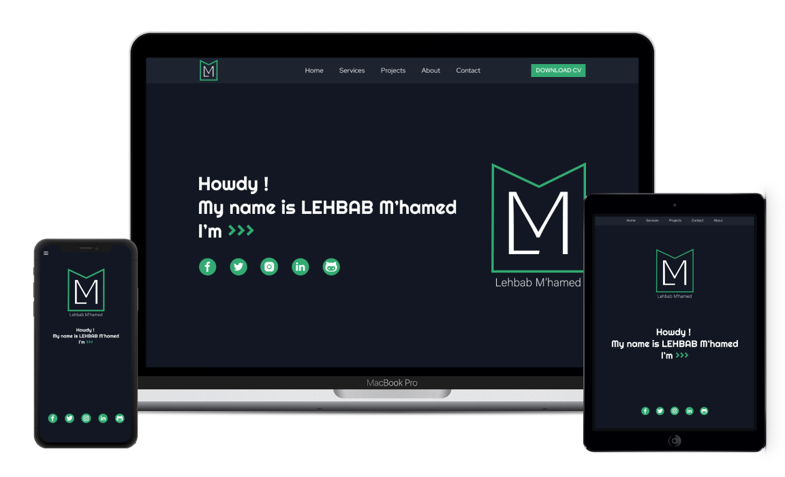

# Portfolio built with React

[My personal portfolio](https://lehbabmhamed.netlify.app/) which features some of my github projects as well as my resume and technical skills.

# Figma sketch
You can view the Desktop, Tablet and Mobile [Here](https://www.figma.com/file/PojJcK22YxLabnITOeZHTV/React-portfolio?node-id=12%3A4)

## Features
 * Full responsive (Desktop, Tablet and mobile).
 * Styled with ReactBootstrap.

## Installation $ Setup
You can fork this repo to modify and make changes of your own. Please give me proper credit by linking back to [GitGud31](https://github.com/GitGud31). Thanks!

1. Installation: `npm install`
2. In the project directory, you can run: `npm start`
3. Open `http://localhost:3000` to view it in the browser.
4. If you want to impelement the *Send email* in *Contact*, you should have an account at [EmailJS](https://www.emailjs.com/)
5. Replace `SERVICE_ID, TEMPLATE_ID, USER_ID` in the `sendEmail()` inside `Contact.jsx`.

## Suggest a feature
* [Feature request](https://github.com/GitGud31/public-react-portfolio/issues)
## Report a bug
* [Bug report](https://github.com/GitGud31/public-react-portfolio/issues)

Give a ⭐ if you like this website!